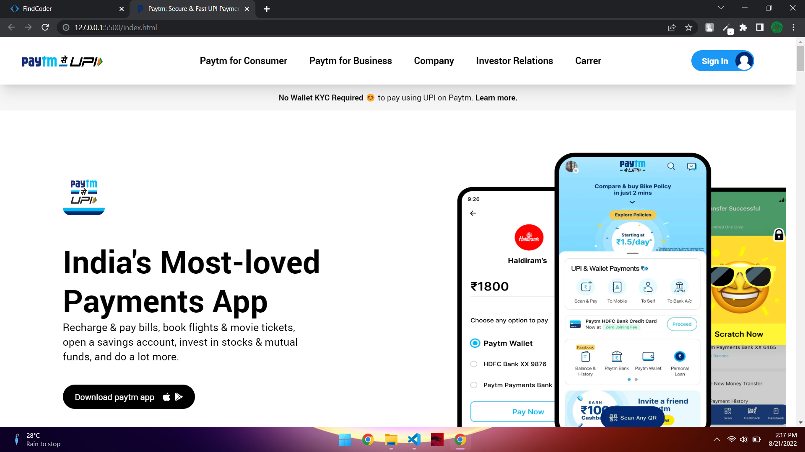

# Clone of Paytm 

## Hi there, I am `Akshay Barapatre` Aspiring FullStack Javascript Developer   

---

## Short View of Website

---

 
## Paytm Clone [Live Link](https://paytm-clone-by-akshay-barapatre.netlify.app/)

-   Skills Gained in this project
    -   Learned various things of tailwind css
    -   Learned how to used documentataion
    -   Learn positioning and flex box in tailwind
    

---

## Time taken to finish this project

-   10 hour taken to complete this project.

